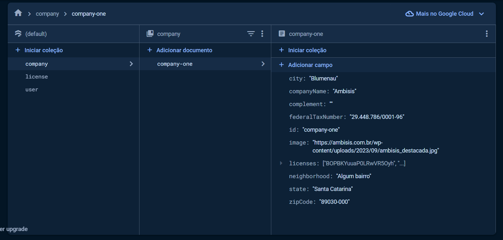
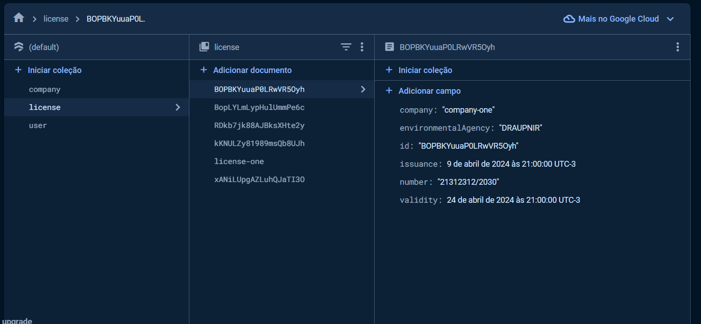
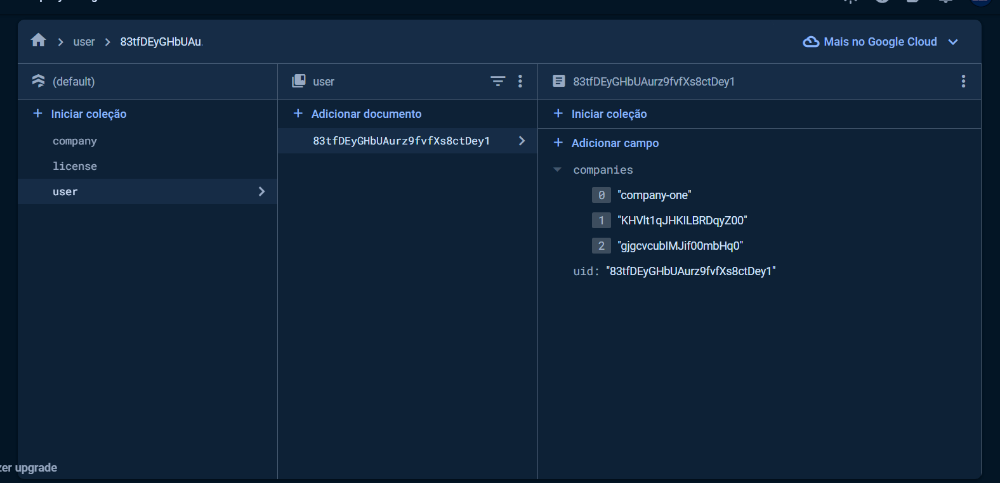

# Company Manager (Administrador de Empresas e suas Licenças)

🖖 *A project made by [Sum117](https://github.com/sum117).*

🇺🇸 This Readme is available in [English](#english) and [Portuguese](#portugues)
🇧🇷 Esse Readme está disponível tanto em [Inglês](#english) quanto em [Português](#portugues)

# Summary
1. [English](#english)
    1.1 [Installation](#installation)
    1.2 [Running Locally](#running-locally)
2. [Português](#portugues)
    2.1 [Instalação](#instalacao)
    2.2 [Rodando Localmente](#rodando-localmente)

# English

## Installation

Getting started with Flutter might seem daunting at first due to the myriad of steps involved in setting up a project. However, thanks to recent advancements in the Flutter framework, the process has become significantly more streamlined, even for newcomers.

⚠️ To install and test this project, you'll need:
- 🤖 [Android Studio](https://developer.android.com/studio?hl=en);
- ✅ [Flutter SDK](https://docs.flutter.dev/get-started/install);
- Your preferred code editor.

The simplest way to get started is by using [Visual Studio Code](https://code.visualstudio.com/) with the [Flutter extension](https://marketplace.visualstudio.com/items?itemName=Dart-Code.flutter). It's frictionless:

1. Open Visual Studio Code.
2. Access the command palette with <kbd>Ctrl</kbd> + <kbd>Shift</kbd> + <kbd>P</kbd>.
3. Type `flutter` in the command palette.
4. Select `Flutter: New Project`.
5. A dialog box will appear in the bottom-right corner of your screen asking if you want to install the SDK. Confirm and wait for the installation to complete.

💡 If you prefer not to install Flutter through Visual Studio Code, you can follow the manual installation instructions provided in [this guide](https://docs.flutter.dev/get-started/install).

## Running Locally

Now that you have Flutter installed on your system, clone the repository using your terminal:

```sh
git clone https://github.com/sum117/flutter-company-manager
cd flutter-company-manager
```

You'll need the Firebase CLI to configure the project. The simplest way is to install it using NPM (Node.js is required). However, if you prefer not to do this, you can follow [this guide](https://firebase.google.com/docs/cli#install-cli-npm).

### Using Node.js

```sh
npm install -g firebase-tools
# With this command executed, you can directly use firebase-tools to configure the project.
```

Now, inside the project directory, run the following command:

```sh
firebase login
```

Then,

```sh
dart pub global activate flutterfire_cli
```

Finally, execute the configuration script, making sure you are in the project directory.

```sh
flutterfire configure
```

For this command to work, you need a Firestore session with the following collections and base documents:





To test authentication locally, you need to go to the overview of your Firebase project, create an application, and include a test SHA-1 key. To generate one, simply open the android directory of the project and run the following command:

```sh
cd android && ./gradlew signingReport
```

Everything should be set up now. You can test the application with `flutter run` after initializing your virtual machine with a specific test phone.

# Portugues

## Instalação

A parte mais complicada para algumas pessoas é começar com o flutter, por conta da quantia de etapas que devem ser tomadas para iniciar um projeto. Felizmente, o flutter anda melhorando bastante nos ultimos tempos, e tudo se tornou bem mais facil desde a versão recente do SDK.

⚠️ Para instalar esse projeto para testes, sãpo necessários:
- 🤖 [Android Studio](https://developer.android.com/studio?hl=pt-br);
- ✅ [Flutter SDK](https://docs.flutter.dev/get-started/install/windows/desktop)
- O seu editor de preferido.

A maneira mais simples é utilizar o [Visual Studio Code](https://code.visualstudio.com/) com a extensão [Flutter](https://marketplace.visualstudio.com/items?itemName=Dart-Code.flutter). Não tem atrito, é simples assim:

1. Abra o Visual Studio Code;
2. Abra a paleta de comandos com <kbd>Ctrl</kbd> + <kbd>Shift</kbd> + <kbd>P</kbd>;
3. Na paleta de comandos, escreva `flutter`;
4. Selecione `Flutter: New Project`;
5. No canto inferior direito de sua tela, uma caixa de dialogo irá aparecer perguntando se você quer instalar o SDK. Diga que sim, e aguarde a instalação.

💡Se você não quer instalar o flutter com o Visual Studio Code, é possível fazer a instalação manual seguindo esta [guia](https://docs.flutter.dev/get-started/install/windows/desktop?tab=vscode) na parte de "Download the Flutter SDK".

## Rodar Localmente

Agora que você já tem o flutter instalado no sistema, clone o repositorio utilizando o seu shell:

```sh
git clone https://github.com/sum117/flutter-company-manager
cd flutter-company-manager
```

Você irá precisar do Firebase CLI para configurar o projeto. A maneira mais simples é instalá-lo com NPM (O node será necessário), mas caso não esteja com vontade de fazer isso, pode seguir essa [guia](https://firebase.google.com/docs/cli?hl=pt-br#setup_update_cli).

### Seguindo com o Node

```sh
npm install -g firebase-tools
# Com esse comando executado, você poderá usar o firebase-tools diretamente para configurar o projeto.
```

Agora, dentro do diretório do projeto, execute o comando:

```sh
firebase login
```

E em seguida,

```sh
dart pub global activate flutterfire_cli
```

Finalmente, execute a script de configuração, e mais uma vez, certifique-se de estar no diretório do projeto.

```sh
flutterfire configure
```

Para que esse comando funcione, é necessário uma sessão no Firestore com as seguintes coleções e documentos-base:


Para testar a autenticação localmente, você precisa ir na visão geral do seu projeto firebase, criar uma aplicação e incluir uma chave de teste sha-1. Para gerar uma, simplesmente abra o diretorio android do projeto e execute o comando:

```sh
cd android && ./gradlew signingReport
```

Já deve estar tudo pronto. Você pode testar o aplicativo com `flutter run` depois de inicializar a sua máquina virtual com um telefone especifico para testes.
